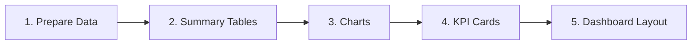

# Book Fair Sales Dashboard (Excel)

**An interactive Excel dashboard I built as the capstone for the "Data Analysis Using Excel" course on Hash Plus — tracking a week-long book fair's sales, revenue, and visitors across publishers, categories, pavilions, and cities.**

---

## Table of Contents
- [About the Course](#about-the-course)
- [What the Project Contains](#what-the-project-contains)
- [How I Built It](#how-i-built-it)
- [Key Metrics](#key-metrics)
- [Insights](#insights)
- [Dashboard](#dashboard)
- [Skills Demonstrated](#skills-demonstrated)
- [Author](#author)

---

## About the Course

This project was my final deliverable for **تحليل البيانات باستخدام الإكسل (Data Analysis Using Excel)**, a course offered by [Hash Plus](https://hashplus.com), an Arabic online learning platform. It builds on my earlier project from the [Excel Fundamentals](https://github.com/wajd-cs/telecom-data-analysis-excel) course, moving from single-table formulas to a multi-sheet workbook with summary tables and a full dashboard.

After completing the course, I built this dashboard to apply what I learned, and received a certificate **Awarded with Distinction** (September 2026).

## What the Project Contains

A workbook (`book-fair-dashboard.xlsx`) with three sheets:

1. **البيانات (Data)** — 21 daily records from a 7-day book fair (3 pavilions × 7 days, data in Arabic), stored as an Excel Table with columns for date, city, pavilion, publisher, book category, books sold, revenue, and visitors.
2. **التحليل (Analysis)** — summary tables built with `SUMIFS`: revenue by publisher, books sold by category, visitors by day, and books sold by pavilion.
3. **لوحة المعلومات (Dashboard)**:
   - **5 KPI cards** — total books sold, total revenue, average daily visitors, number of participating publishers, total visitors
   - **4 charts** — revenue by publisher, sales by category, visitor trend over the fair's days, and a pavilion comparison

## How I Built It

**1. Prepared the data** — organized the raw records into an Excel Table with consistent columns, so every calculation reads from one source.

**2. Built summary tables** with `SUMIFS`, summarizing the data from different angles: revenue by publisher, books sold by category, visitors by date, and books sold by pavilion. Each table updates automatically when the data changes.

**3. Created charts** from each summary table, choosing the chart type that fits the question:

| Chart | Type | Why |
|---|---|---|
| Revenue by publisher | Column | Comparing values across a few groups |
| Sales by category | Bar | Easy-to-read category labels |
| Visitor trend | Line | Showing change over time |
| Pavilion comparison | Pie | Share of a whole |

**4. Designed KPI cards** — headline numbers at the top of the dashboard. Two of them needed counting *unique* values rather than rows, since each day has one row per pavilion:

| KPI | Formula |
|---|---|
| Participating publishers | `=SUMPRODUCT(1/COUNTIF(publisher_col, publisher_col))` |
| Average daily visitors | `=SUM(visitors_col) / SUMPRODUCT(1/COUNTIF(date_col, date_col))` |

**5. Laid out the dashboard** — arranged KPIs on top and charts below with a consistent blue color theme for a clean, readable view.

## Key Metrics

| Metric | Value |
|---|---|
| Total books sold | 3,260 |
| Total revenue | 97,800 SAR |
| Total visitors | 10,940 |
| Participating publishers | 3 |
| Fair duration | 7 days |
| Average daily visitors | ~1,563 |

## Insights

- **Al-Ibdaa (الإبداع) leads in revenue** with 41,100 SAR — about 42% of the total — followed by Al-Maarifa (33,000) and Al-Fikr (23,700).
- **Children's books were the best-selling category**, ahead of Literature and History.
- **Visitor numbers declined through the week**, from around 1,900 on the first day to about 1,270 on the last — a drop of roughly a third, suggesting the fair could benefit from mid-week promotions or events.

## Dashboard

## Skills Demonstrated

- **Conditional Aggregation** — summarizing data from multiple perspectives with `SUMIFS`
- **Distinct Counting** — counting unique values with `SUMPRODUCT` + `COUNTIF` instead of counting rows
- **Data Visualization** — choosing the right chart type for each question
- **KPI Design** — surfacing the most important numbers at a glance
- **Dashboard Design** — organizing metrics and visuals into one clear, consistent layout
- **Business Thinking** — turning trends into actionable recommendations

## Author

**Wajd Alluhaibi**
Computer Science Student | Data Analysis & Software Development

